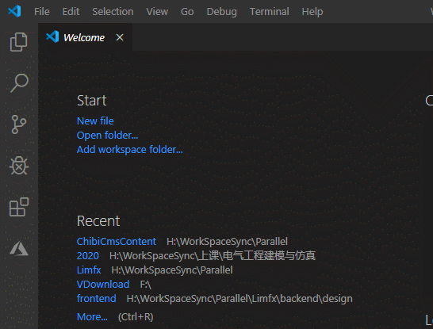
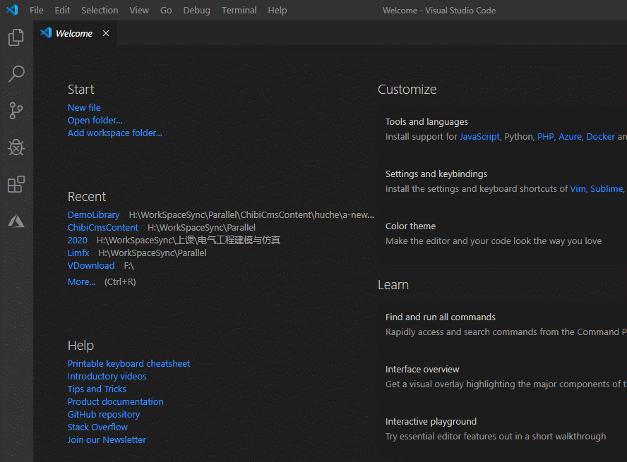
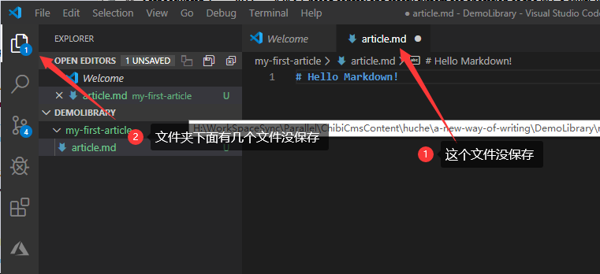
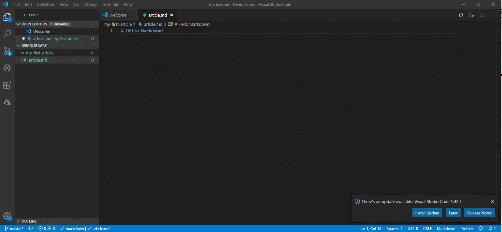
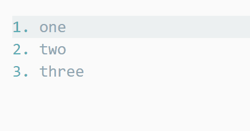
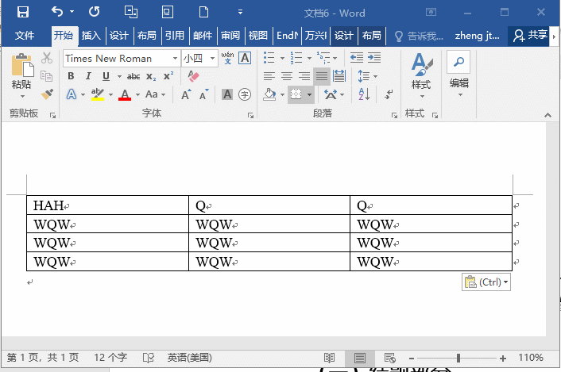
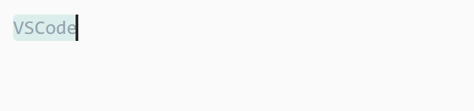

<big>Markdown 使用技巧</big>

## 1. VsCode安装、配置MarkDown
[VsCode下载地址](https://code.visualstudio.com/)  
安装很简单，什么都不用管，一路Next即可。  
之所以用vscode写markdown在于它可以通过插件扩展很多实用的功能。  
这里首推4个必装插件：
- markdown all in one 辅助我们在vscode中进行Markdown写作
- markdown pdf 渲染成pdf文档，供不会使用markdown的人阅读
- paste image 允许图片直接复制、粘贴到markdown
- code spell checker 帮你找出英文错别字，中文版是spell right  
 


1.1 首先在你的硬盘上建一个文件夹做为仓库，所有的文章都可以放在这个文件夹中。    
1.2 创建你的第一篇文章：用VSCODE打开这个文件夹，然后再VSCODE的文件管理器，再这个文件夹下面创建一个子文件夹，起个名字，再这个文件夹下面创建一个文件，扩展名是md。每一篇文章就是一个文件夹，文件夹名字和文章标题相关，虽然不强求，但是这样优雅一些可以避免很多麻烦，然后我们打开在这个文章就可以写作了。 



1.3 保存当前文章的快捷键是ctrl+s，即使你忘了保存也不必担心，下一次打开VSCODE的时候，会自行加载你写过的文章，不过我还是建议您经常保存。当你的文件夹线面有文件没保存的时候会有提示。  



这个时候你可以按找下面图中操作打开分屏预览，边写边看效果。



Markdown写起来非常顺畅，因为格式是直接使用标记实现的，可以做到全程不离开键盘。

## 2. Markdown 常用代码格式  
### 2.1 标题  
在文字前面打上#加一个空格即可让这一行的文字变成标题，#的个数代表标题的级别。  

1. # #  一级标题      <!-- {docsify-ignore} -->
2. ## ##  二级标题    <!-- {docsify-ignore} -->
3. ### ###  三级标题  <!-- {docsify-ignore} -->
4. #### ####  四级标题      <!-- {docsify-ignore} -->
5. ##### ##### 五级标题     <!-- {docsify-ignore} -->
6. ###### ######  六级标题  <!-- {docsify-ignore} -->
   ......

### 2.2 段落  
我们写文章的时候，按一次回车键，光标会换一行，但实际上并不会换行，那要怎么做呢？
想要换行的时候，按两次回车键即可；或者写完这一段之后，按两次空格键，再按一次回车键即可。
区别在于两次空格加一次回车，两行之间的距离会相对近一点点，通常我们都是连按两次回车（或连按↓两次）来结束上一段落。

### 2.3 强调  
MarkDown的强调格式有斜体和加粗两种  
文字两边加* *斜体*  
文字两边加** **粗体**  
*前面最好有个空格，以增强Markdown渲染器兼容性；如果安装了Markdown All in One 还可和Word一样，用ctrl加I，ctrl加B来切换选中文字的斜体和加粗。

### 2.4 列表  
上面演示标题就用了顺序列表
列表书写方式： 可以从任意数字开始，若从9后面加.加一个空格加内容，回车之后会自动往下编号，如：   
10. 内容  
11. 内容   
12. 内容  
    ......  
无编号列表， * - + 这三种符号都可以，符号和内容之间留一个空格：  
* 这是书写*无编号的列表  
- 书写-也可以  
+ 书写+也可以  
如果你使用了Markdown All in One 还有自动补全的功能，你可以自行摸索一下。  


### 2.5 插入图片  
格式为：  
```
     
*图片描述*
```  
描述就是鼠标停留在图片上才会显示的字，也可以不写  
如果安装了前面推荐的Paste Image插件，在别处复制了图片，然后在想插入图片的地方按ctrl+alt+v，即可将图片插入。

## 3. 公式  
公式是Markdown的招牌之一，它支持Latex格式公式，虽然新版的Word也支持了，Markdown写起来更为流畅快速。  
首先我们有inline公式只要在文中输入一个美元符号，之间得内容就是公示了，注意美元符号要和前后的文本之间有个空格，确保兼容性：$\lim_{x \to \infin}f(x)$，效果就是： lim x→∞f(x)

当然，你也可以写独立的公式，一对美元符号之间的内容：  
```
$$
\lim_{x \to 0}\frac{sin(t)}{x}=1
$$

$$
\lim_{x \to \infin}x^{\frac{1}{x}}=1
\\
f(x)=\beta_1 x+\beta_2
\tag{1}
$$  
```  
可以看到公式是线性写的，你在纸上怎么写这里也怎么写。公式重要换行的话需要输入一行\\，可以输入\tag{1}来给公式编号。

## 4. 表格

书写格式：  
- Markdown | Less | Pretty  
- --- | :---: | ---:  
- *默认左对齐* | `此列剧中` | **此列右对齐**  
- 1 | 2 | 3  
- 11 | 22 | 33

演示：

Markdown | Less | Pretty
--- | :---: | ---:
*默认左对齐* | `此列剧中` | **此列右对齐**
1 | 2 | 3
11 | 22 | 33

首先用 | 来定义列，--- | :---: | ---:这个放在第一列下面用于区分表头，冒号得位置用来决定事剧中还是右对齐、左对齐。

有个简单的玩法就是：Markdown Tables Generator  
在这里你可以把word，excel里面的表格直接粘贴到网页中，然后生成对应的整齐的Markdown表格。  


## 5. 链接  
可以连接到网上某个url网址，格式：
```[冬阳雪](https://www.uts.run)```  
如果使用Markdown All in One,则可复制一个合法的url，然后选中某个文字直接粘贴变成一个链接。  
  

## 6. 代码块  
我们平时会使用到代码，Markdown最闪耀的就是渲染代码里，如果渲染器支持可以实现各种语言语法的高亮。首先是inline代码，只要再行中写两个``之间的就会被认为是代码，不会被Markdown渲染格式。但是inline代码不支持指定语言。你可以这么写：

 `python  
 s = "Python syntax highlighting"  
 print s  
 `  

 `javascript  
 var s = "JavaScript syntax highlighting";  
 alert(s);  
 `  
 
效果就是:    
```
s = "Python syntax highlighting"
print s  
```  
```
var s = "JavaScript syntax highlighting";  
alert(s);
```

## 7. 输出  
由于 MarkDown 本身是一种代码，需要渲染才能够看着比较舒服，如果你发给不会使用 MarkDown 的人可能会有困扰，若我们装了MarkDown PDF，因此可以输出PDF、图片、网页等格式，只需在md文件编辑的地方鼠标右键就可以看到输出为PDF等选项了。  
注意，MarkDown PDF树池不支持公式渲染，大家可以使用 Pandoc 插件，还可以输出为Word文档。除了插件，你还需要安装 Pandoc 这个软件，只需要按下ctrl+shift+p，在命令框中输入pandoc render。

## 8. 分割线，三个减号-

## 9. 引用，在需要引用段落前加上>: 
 
例如： 
>： 笑顔で立ち向かえ，ガンバー！

## 10. 其他  
字体大小只有两种   
格式：
```<big>大</big> <small>小</small>```  
效果：
<big>大</big> <small>小<small>

MarkDown 的代码基本上就这么多了，善于利用不同的插件还可以扩展出非常多好玩的功能，让你的文章别具美感。


 


